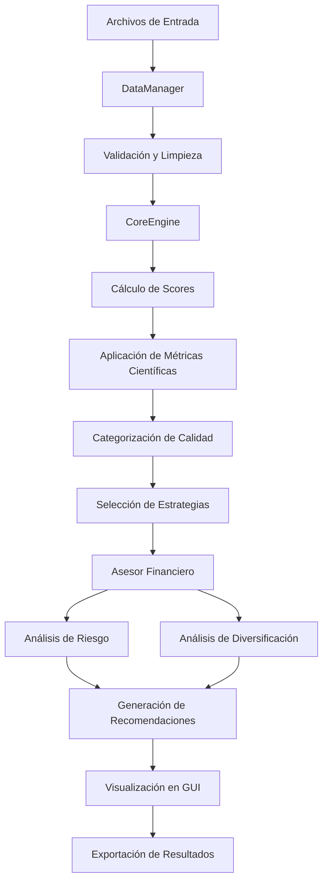

# 📊 KFORCEVSQVARATIOS v2.0 - Documentación Completa del Flujo de Trabajo

## 🎯 Resumen Ejecutivo

**KFORCEVSQVARATIOS v2.0** es un sistema avanzado de análisis y ranking de estrategias de trading que integra métricas científicas, análisis empírico y un asesor financiero inteligente. El sistema está diseñado para profesionales que requieren máxima precisión y robustez en la evaluación de estrategias.

---

## 🏗️ Arquitectura del Sistema

### Componentes Principales

```
┌─────────────────────────────────────────────────────────────┐
│                    KFORCEVSQVARATIOS v2.0                 │
├─────────────────────────────────────────────────────────────┤
│  🖥️  GUI Enhanced (gui_enhanced_rank.py)                 │
│  📊 DataManager (data_manager.py)                         │
│  🔬 CoreEngine Enhanced (core_engine_enhanced.py)         │
│  🧠 Asesor Financiero (asesor_financiero_inteligente.py) │
│  ⚙️  ConfigManager (config_manager_enhanced.py)           │
└─────────────────────────────────────────────────────────────┘
```

---

## 📋 Flujo de Trabajo Detallado

### 1. 🚀 Inicialización del Sistema

#### 1.1 Configuración de Componentes
```python
# Inicialización secuencial de componentes
gui = EnhancedRankGUI()                    # Interfaz gráfica
data_manager = DataManager()               # Gestor de datos
factor_k_engine = FactorKElite96Enhanced() # Motor de análisis
unified_evaluator = UnifiedEvaluatorEnhanced() # Evaluador unificado
config_manager = ConfigManagerEnhanced()   # Gestor de configuración
asesor = AsesorFinancieroInteligente()    # Asesor financiero
```

#### 1.2 Modos de Operación
- **Modo Desarrollo**: Usa datos de INPUTTEST para pruebas
- **Modo Producción**: Usa rutas de usuario para datos reales
- **Detección Automática**: El sistema detecta automáticamente el modo según archivos disponibles

### 2. 📁 Carga y Validación de Datos

#### 2.1 Estructura de Datos Requerida

**Archivo KPIs (DatabankExport_M1.csv):**
```csv
Strategy_Name,timeframe,total_data_months,#_of_trades,net_profit_is,net_profit_oos,
sharpe_ratio_is,sharpe_ratio_oos,profit_factor_is,profit_factor_oos,
max_drawdown_is,max_drawdown_oos,cagr_is,cagr_oos,winning_percent_is,
winning_percent_oos,calmarratio_is,calmarratio_oos
```

**Archivo de Mercado (DATOSMQL5.csv):**
```csv
Date,Open,High,Low,Close,Volume
```

#### 2.2 Proceso de Validación
```python
# Validación automática de datos
1. Verificar columnas requeridas
2. Validar tipos de datos numéricos
3. Detectar valores faltantes o extremos
4. Normalizar nombres de columnas
5. Aplicar limpieza de datos
```

#### 2.3 Mapeo de Columnas
```python
COLUMN_MAPPING = {
    'net_profit_is': 'Net_Profit_IS',
    'net_profit_oos': 'Net_Profit_OOS',
    'sharpe_ratio_is': 'Sharpe_Ratio_IS',
    'sharpe_ratio_oos': 'Sharpe_Ratio_OOS',
    'max_drawdown_is': 'Max_Drawdown_IS',
    'max_drawdown_oos': 'Max_Drawdown_OOS',
    'profit_factor_is': 'Profit_Factor_IS',
    'profit_factor_oos': 'Profit_Factor_OOS',
    'cagr_is': 'CAGR_IS',
    'cagr_oos': 'CAGR_OOS'
}
```

### 3. ⚙️ Configuración de Análisis

#### 3.1 Parámetros de Configuración
```python
# Parámetros principales
style = "CONSERVADOR"          # Estilo de trading
percentil = 20                 # Percentil para filtrado
top_n = 10                     # Número de estrategias a seleccionar
selected_kpis = 5              # KPIs seleccionados para análisis
```

#### 3.2 Estilos de Trading Disponibles
- **CONSERVADOR**: Enfoque en preservación de capital
- **MODERADO**: Balance entre riesgo y retorno
- **AGRESIVO**: Maximización de retornos

#### 3.3 KPIs Disponibles
```python
KPIS_DISPONIBLES = [
    'net_profit_is', 'net_profit_oos',
    'sharpe_ratio_is', 'sharpe_ratio_oos',
    'profit_factor_is', 'profit_factor_oos',
    'max_drawdown_is', 'max_drawdown_oos',
    'cagr_is', 'cagr_oos',
    'winning_percent_is', 'winning_percent_oos',
    'calmarratio_is', 'calmarratio_oos'
]
```

### 4. 🔬 Análisis Principal (CoreEngine)

#### 4.1 Proceso de Evaluación

**Paso 1: Preparación de Datos**
```python
# Normalización y limpieza
df_clean = normalizar_columnas_y_kpis(df_raw)
df_validated = validate_input_data(df_clean)
```

**Paso 2: Cálculo de Componentes Principales**
```python
# Análisis de componentes principales (PCA)
pca_features = ['net_profit_is', 'sharpe_ratio_is', 'profit_factor_is', 
                'max_drawdown_is', 'cagr_is', 'winning_percent_is']
pca_result = PCA(n_components=3).fit_transform(df[pca_features])
```

**Paso 3: Cálculo de Scores Base**
```python
# Score unificado base
df['Unified_Score'] = (
    0.3 * normalized_net_profit +
    0.25 * normalized_sharpe_ratio +
    0.2 * normalized_profit_factor +
    0.15 * normalized_cagr +
    0.1 * normalized_winning_percent
)
```

**Paso 4: Aplicación de Métricas Científicas**
```python
# Métricas científicas avanzadas
if scientific_improvements_enabled:
    # Análisis de predictibilidad IS/OOS
    df['IS_OOS_Predictivity'] = calculate_is_oos_predictivity(df)
    
    # Análisis de estabilidad temporal
    df['Temporal_Stability'] = calculate_temporal_stability(df)
    
    # Score científico mejorado
    df['Unified_Score_Scientific'] = (
        df['Unified_Score'] * 0.7 +
        df['IS_OOS_Predictivity'] * 0.2 +
        df['Temporal_Stability'] * 0.1
    )
```

#### 4.2 Algoritmos de Métricas Científicas

**Predictibilidad IS/OOS:**
```python
def calculate_is_oos_predictivity(df):
    """
    Calcula la predictibilidad entre datos IS y OOS
    """
    is_metrics = ['net_profit_is', 'sharpe_ratio_is', 'profit_factor_is']
    oos_metrics = ['net_profit_oos', 'sharpe_ratio_oos', 'profit_factor_oos']
    
    correlations = []
    for is_metric, oos_metric in zip(is_metrics, oos_metrics):
        corr = df[is_metric].corr(df[oos_metric])
        correlations.append(abs(corr))
    
    return np.mean(correlations)
```

**Estabilidad Temporal:**
```python
def calculate_temporal_stability(df):
    """
    Calcula la estabilidad temporal de las métricas
    """
    # Análisis de consistencia a lo largo del tiempo
    volatility_metrics = ['net_profit_is', 'sharpe_ratio_is']
    stability_scores = []
    
    for metric in volatility_metrics:
        # Coeficiente de variación (menor = más estable)
        cv = df[metric].std() / abs(df[metric].mean())
        stability_scores.append(1 / (1 + cv))
    
    return np.mean(stability_scores)
```

#### 4.3 Categorización de Calidad
```python
def categorize_quality(df, score_col="Unified_Score"):
    """
    Categoriza estrategias por calidad usando percentiles
    """
    percentiles = df[score_col].quantile([0.2, 0.4, 0.6, 0.8])
    
    def cat(val):
        if val >= percentiles[0.8]: return "Excelente"
        elif val >= percentiles[0.6]: return "Muy Bueno"
        elif val >= percentiles[0.4]: return "Bueno"
        elif val >= percentiles[0.2]: return "Regular"
        else: return "Pobre"
    
    return df[score_col].apply(cat)
```

### 5. 🎯 Selección de Estrategias

#### 5.1 Filtrado por Categorías
```python
# Selección por categoría de calidad
estrategias_excelentes = df[df['Quality_Category'] == 'Excelente']
estrategias_muy_buenas = df[df['Quality_Category'] == 'Muy Bueno']
# ... etc
```

#### 5.2 Selección Top-N
```python
# Selección de las N mejores estrategias
top_n_strategies = df.nlargest(top_n, 'Unified_Score_Scientific')
```

#### 5.3 Criterios de Selección
- **Score Científico**: Prioridad principal
- **Consistencia**: Estrategias con métricas estables
- **Diversificación**: Evitar correlación excesiva entre estrategias

### 6. 🧠 Análisis del Asesor Financiero

#### 6.1 Preparación de Datos para el Asesor
```python
# Datos preparados para análisis del asesor
asesor_data = {
    'strategies': selected_strategies,
    'market_data': market_df,
    'timeframe': detected_timeframe,
    'risk_profile': user_risk_profile
}
```

#### 6.2 Análisis del Asesor
```python
# Ejecución del análisis del asesor
resultados_asesor = asesor.analizar_estrategias(
    estrategias=selected_strategies,
    datos_mercado=market_data,
    perfil_riesgo=risk_profile
)
```

#### 6.3 Componentes del Análisis del Asesor

**Análisis de Riesgo:**
```python
def analizar_riesgo(estrategias):
    """
    Análisis de riesgo de las estrategias seleccionadas
    """
    risk_metrics = {
        'max_drawdown': estrategias['max_drawdown_is'].max(),
        'var_95': calculate_var_95(estrategias),
        'correlation_matrix': estrategias[['net_profit_is', 'sharpe_ratio_is']].corr(),
        'portfolio_volatility': calculate_portfolio_volatility(estrategias)
    }
    return risk_metrics
```

**Análisis de Diversificación:**
```python
def analizar_diversificacion(estrategias):
    """
    Análisis de diversificación del portafolio
    """
    # Correlación entre estrategias
    correlation_matrix = estrategias[performance_metrics].corr()
    
    # Diversificación efectiva
    effective_diversification = 1 - np.mean(np.abs(correlation_matrix))
    
    return {
        'correlation_matrix': correlation_matrix,
        'effective_diversification': effective_diversification,
        'concentration_risk': calculate_concentration_risk(estrategias)
    }
```

**Recomendaciones Personalizadas:**
```python
def generar_recomendaciones(analisis_riesgo, analisis_diversificacion):
    """
    Genera recomendaciones personalizadas basadas en el análisis
    """
    recomendaciones = []
    
    if analisis_riesgo['max_drawdown'] > 0.15:
        recomendaciones.append("⚠️ Alto riesgo de drawdown - Considerar estrategias más conservadoras")
    
    if analisis_diversificacion['effective_diversification'] < 0.7:
        recomendaciones.append("📊 Baja diversificación - Considerar estrategias adicionales")
    
    return recomendaciones
```

### 7. 📊 Visualización y Reportes

#### 7.1 Pestañas del Asesor

**Pestaña Científica:**
- Métricas científicas detalladas
- Análisis de predictibilidad IS/OOS
- Gráficos de estabilidad temporal

**Pestaña Empírica:**
- Estadísticas empíricas tradicionales
- Análisis de distribución de retornos
- Métricas de riesgo clásicas

**Pestaña de Estrategias Seleccionadas:**
- Lista detallada de estrategias seleccionadas
- Métricas individuales por estrategia
- Opciones de exportación

#### 7.2 Funcionalidades Avanzadas

**Popup de Detalles:**
```python
def show_strategy_details(event):
    """
    Muestra detalles completos de una estrategia
    """
    strategy_name = get_selected_strategy(event)
    strategy_data = df[df['Strategy_Name'] == strategy_name]
    
    # Crear ventana de detalles
    detail_window = tk.Toplevel()
    detail_window.title(f"Detalles: {strategy_name}")
    
    # Mostrar métricas detalladas
    show_detailed_metrics(strategy_data, detail_window)
```

**Scrollbars y Navegación:**
```python
def add_scrollbars_to_table(parent):
    """
    Añade scrollbars a las tablas de resultados
    """
    # Scrollbar vertical
    v_scrollbar = tk.Scrollbar(parent, orient="vertical")
    v_scrollbar.pack(side="right", fill="y")
    
    # Scrollbar horizontal
    h_scrollbar = tk.Scrollbar(parent, orient="horizontal")
    h_scrollbar.pack(side="bottom", fill="x")
    
    return v_scrollbar, h_scrollbar
```

### 8. 📈 Métricas y KPIs

#### 8.1 Métricas Científicas

**Unified_Score_Scientific:**
```python
# Score científico que combina métricas tradicionales con análisis avanzado
Unified_Score_Scientific = (
    Unified_Score_Base * 0.7 +
    IS_OOS_Predictivity * 0.2 +
    Temporal_Stability * 0.1
)
```

**Unified_Score_Enhanced:**
```python
# Score mejorado con métricas adicionales
Unified_Score_Enhanced = (
    Unified_Score_Scientific * 0.8 +
    Risk_Adjusted_Return * 0.15 +
    Consistency_Score * 0.05
)
```

#### 8.2 Métricas Empíricas

**Sharpe Ratio:**
```python
sharpe_ratio = (return_mean - risk_free_rate) / return_std
```

**Profit Factor:**
```python
profit_factor = gross_profit / gross_loss
```

**Maximum Drawdown:**
```python
def calculate_max_drawdown(returns):
    cumulative = (1 + returns).cumprod()
    running_max = cumulative.expanding().max()
    drawdown = (cumulative - running_max) / running_max
    return drawdown.min()
```

**CAGR (Compound Annual Growth Rate):**
```python
cagr = (final_value / initial_value) ** (1 / years) - 1
```

### 9. 🔄 Flujo de Datos Completo



### 10. ⚡ Optimizaciones y Mejoras

#### 10.1 Optimización de Rendimiento
- **Procesamiento paralelo**: Análisis de múltiples estrategias en paralelo
- **Caching de resultados**: Almacenamiento de cálculos intermedios
- **Lazy loading**: Carga de datos bajo demanda

#### 10.2 Mejoras Científicas
- **Análisis de predictibilidad**: Evaluación de la capacidad predictiva IS/OOS
- **Estabilidad temporal**: Análisis de consistencia a lo largo del tiempo
- **Análisis de robustez**: Evaluación de la resistencia a cambios de mercado

### 11. 🛠️ Configuración y Personalización

#### 11.1 Archivo de Configuración
```json
{
    "scientific_improvements_enabled": true,
    "default_style": "CONSERVADOR",
    "default_percentil": 20,
    "default_top_n": 10,
    "risk_free_rate": 0.02,
    "max_drawdown_threshold": 0.15
}
```

#### 11.2 Variables de Entorno
```bash
KFORCE_DEV_MODE=true          # Modo desarrollo
KFORCE_LOG_LEVEL=INFO         # Nivel de logging
KFORCE_CACHE_ENABLED=true     # Habilitar cache
```

### 12. 📊 Interpretación de Resultados

#### 12.1 Scores y Categorías
- **Excelente (Top 20%)**: Estrategias de máxima calidad
- **Muy Bueno (20-40%)**: Estrategias de alta calidad
- **Bueno (40-60%)**: Estrategias de calidad media-alta
- **Regular (60-80%)**: Estrategias de calidad media
- **Pobre (80-100%)**: Estrategias de baja calidad

#### 12.2 Métricas Clave a Observar
1. **Unified_Score_Scientific**: Score principal para selección
2. **IS_OOS_Predictivity**: Capacidad predictiva
3. **Temporal_Stability**: Estabilidad temporal
4. **Max_Drawdown**: Riesgo máximo de pérdida
5. **Sharpe_Ratio**: Retorno ajustado por riesgo

### 13. 🔍 Troubleshooting y Debugging

#### 13.1 Problemas Comunes

**Error: "Columnas requeridas faltantes"**
```python
# Solución: Verificar mapeo de columnas en DataManager
COLUMN_MAPPING = {
    'net_profit_is': 'Net_Profit_IS',
    # ... resto del mapeo
}
```

**Error: "The truth value of a Series is ambiguous"**
```python
# Solución: Usar métodos específicos de pandas
if df.empty:  # En lugar de if df:
    # código aquí
```

**Error: "maximum recursion depth exceeded"**
```python
# Solución: Evitar hasattr() en constructores de Tkinter
# Usar getattr() con valor por defecto
method = getattr(self, 'method_name', None)
```

#### 13.2 Logs y Diagnóstico
```python
# Habilitar logging detallado
import logging
logging.basicConfig(level=logging.DEBUG)

# Verificar estado de componentes
print(f"DataManager: {data_manager is not None}")
print(f"CoreEngine: {factor_k_engine is not None}")
print(f"GUI: {gui is not None}")
```

### 14. 🚀 Próximas Mejoras

#### 14.1 Funcionalidades Planificadas
- **Análisis de Machine Learning**: Integración de modelos ML para predicción
- **Backtesting Avanzado**: Simulación histórica detallada
- **Optimización de Portafolio**: Algoritmos de optimización de Markowitz
- **Análisis de Regímenes**: Detección de cambios de régimen de mercado

#### 14.2 Mejoras Técnicas
- **Interfaz Web**: Versión web del sistema
- **API REST**: Interfaz programática
- **Base de Datos**: Persistencia de resultados
- **Cloud Computing**: Procesamiento en la nube

---

## 📝 Conclusión

KFORCEVSQVARATIOS v2.0 representa un sistema avanzado y robusto para el análisis profesional de estrategias de trading. La integración de métricas científicas, análisis empírico y un asesor financiero inteligente proporciona una herramienta completa para la toma de decisiones informadas en mercados financieros.

El sistema está diseñado para ser:
- **Profesional**: Cumple con estándares de la industria
- **Robusto**: Manejo robusto de errores y validaciones
- **Escalable**: Arquitectura modular para futuras expansiones
- **Intuitivo**: Interfaz clara y funcionalidades bien documentadas

---

*Documentación generada automáticamente por KFORCEVSQVARATIOS v2.0*
*Fecha: 2025-07-11*
*Versión: 2.0* 