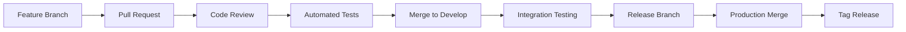

# 🌿 Git Branching Strategy - KFORCEVSQVARATIOS v2.0

## 📋 Overview

Esta estrategia de branching está diseñada para facilitar el desarrollo colaborativo, mantener la estabilidad del código y permitir la escalabilidad del proyecto KFORCEVSQVARATIOS v2.0.

---

## 🏗️ Branch Structure

### Main Branches

| Branch | Purpose | Protection |
|--------|---------|------------|
| `main` | Production-ready code | ✅ Protected |
| `develop` | Integration branch | ✅ Protected |

### Feature Branches

| Prefix | Component | Example |
|--------|-----------|---------|
| `feature/gui/` | GUI Enhancements | `feature/gui/metrics-panel` |
| `feature/core/` | Core Engine | `feature/core/pca-optimization` |
| `feature/data/` | Data Management | `feature/data/validation-improvements` |
| `feature/analysis/` | Scientific Analysis | `feature/analysis/clustering-algorithm` |

### Support Branches

| Prefix | Purpose | Example |
|--------|---------|---------|
| `hotfix/` | Critical production fixes | `hotfix/memory-leak-fix` |
| `release/` | Release preparation | `release/v2.1.0` |
| `testing/` | QA and testing | `testing/integration-tests` |
| `docs/` | Documentation updates | `docs/api-documentation` |

---

## 🔄 Workflow

### 1. Feature Development

```bash
# Start from develop
git checkout develop
git pull origin develop

# Create feature branch
git checkout -b feature/core/pca-optimization

# Develop and commit
git add src/core_engine_enhanced.py
git commit -m "feat(core): optimize PCA algorithm for better performance"

# Push to remote
git push -u origin feature/core/pca-optimization
```

### 2. Pull Request Process

1. **Create PR** from feature branch to `develop`
2. **Code Review** by team members
3. **Automated Tests** must pass
4. **Merge** only after approval

### 3. Release Process

```bash
# Create release branch from develop
git checkout develop
git checkout -b release/v2.1.0

# Final testing and bug fixes
git commit -m "fix: resolve edge case in data validation"

# Merge to main and develop
git checkout main
git merge release/v2.1.0
git tag v2.1.0

git checkout develop
git merge release/v2.1.0

# Clean up
git branch -d release/v2.1.0
```

---

## 📝 Naming Conventions

### Branch Names
- **Format**: `{type}/{component}/{description}`
- **Example**: `feature/core/predictibility-algorithm`

### Commit Messages
- **Format**: `{type}({scope}): {description}`
- **Types**: `feat`, `fix`, `docs`, `style`, `refactor`, `test`, `chore`
- **Example**: `feat(core): implement IS/OOS predictibility analysis`

### Pull Request Titles
- **Format**: `{type}: {component} - {description}`
- **Example**: `Feature: Core Engine - Optimize PCA algorithm`

---

## 🚦 Branch Protection Rules

### Main Branch
- ✅ Require pull request reviews
- ✅ Require status checks to pass
- ✅ Require branches to be up to date
- ✅ Restrict pushes to matching branches

### Develop Branch
- ✅ Require pull request reviews
- ✅ Require status checks to pass
- ✅ Allow force pushes (admin only)

---

## 📊 Branch Lifecycle



---

## 🎯 Best Practices

### Development
- ✅ **One feature per branch**: Keep branches focused and small
- ✅ **Regular commits**: Commit frequently with clear messages
- ✅ **Update from develop**: Rebase feature branches regularly
- ✅ **Delete merged branches**: Keep repository clean

### Code Review
- ✅ **Review all changes**: No direct merges to protected branches
- ✅ **Automated testing**: All tests must pass before merge
- ✅ **Documentation updates**: Include docs for new features
- ✅ **Performance impact**: Consider performance implications

### Release Management
- ✅ **Semantic versioning**: Follow semver for releases
- ✅ **Release notes**: Document all changes
- ✅ **Hotfix process**: Quick fixes for production issues
- ✅ **Rollback plan**: Always have a rollback strategy

---

## 🔧 Git Commands Reference

### Branch Management
```bash
# List all branches
git branch -a

# Create and switch to new branch
git checkout -b feature/core/new-feature

# Delete local branch
git branch -d feature/core/new-feature

# Delete remote branch
git push origin --delete feature/core/new-feature
```

### Workflow Commands
```bash
# Update local develop
git checkout develop
git pull origin develop

# Rebase feature branch
git checkout feature/core/new-feature
git rebase develop

# Squash commits before merge
git rebase -i HEAD~3
```

### Release Commands
```bash
# Create release branch
git checkout -b release/v2.1.0

# Tag release
git tag -a v2.1.0 -m "Release version 2.1.0"

# Push tags
git push origin --tags
```

---

## 📈 Metrics & Monitoring

### Branch Health
- **Average PR review time**: < 24 hours
- **Branch lifetime**: < 2 weeks
- **Test coverage**: > 90%
- **Code review coverage**: 100%

### Quality Gates
- ✅ All automated tests pass
- ✅ Code coverage maintained
- ✅ No critical security issues
- ✅ Documentation updated
- ✅ Performance benchmarks met

---

## 🚨 Emergency Procedures

### Hotfix Process
```bash
# Create hotfix from main
git checkout main
git checkout -b hotfix/critical-bug-fix

# Fix and commit
git commit -m "fix: resolve critical memory leak"

# Merge to main and develop
git checkout main
git merge hotfix/critical-bug-fix
git tag v2.0.1

git checkout develop
git merge hotfix/critical-bug-fix
```

### Rollback Process
```bash
# Revert to previous release
git checkout main
git reset --hard v2.0.0
git push --force origin main

# Notify team immediately
# Document incident and lessons learned
```

---

## 📚 Additional Resources

- **Git Flow**: [Git Flow Documentation](https://nvie.com/posts/a-successful-git-branching-model/)
- **Conventional Commits**: [Conventional Commits](https://www.conventionalcommits.org/)
- **Semantic Versioning**: [SemVer](https://semver.org/)

---

*Git Branching Strategy v1.0 - KFORCEVSQVARATIOS v2.0*  
*Last Updated: 2025-07-11* 